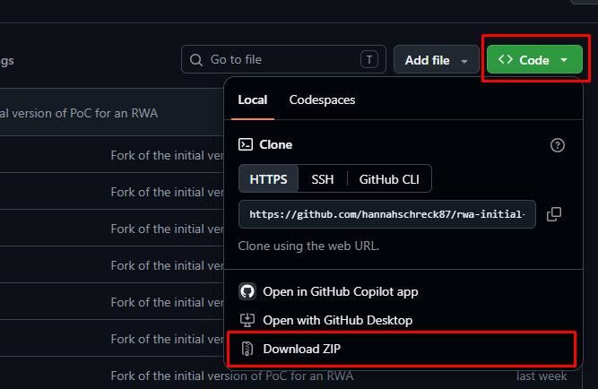
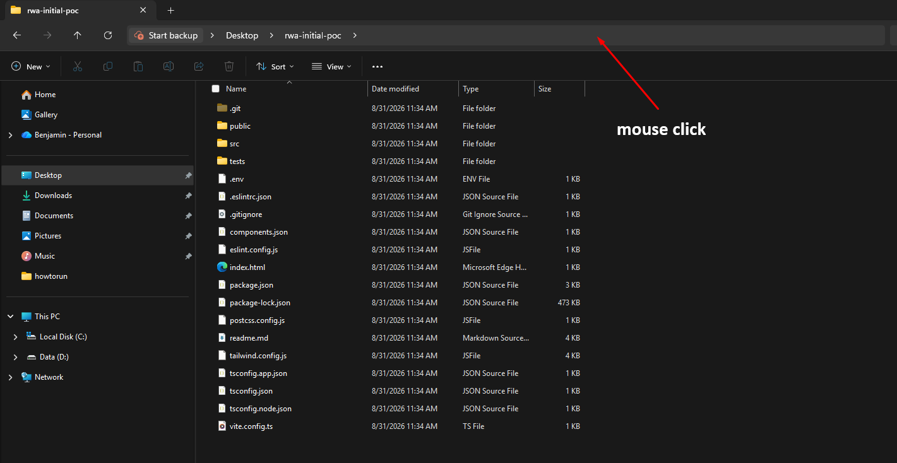
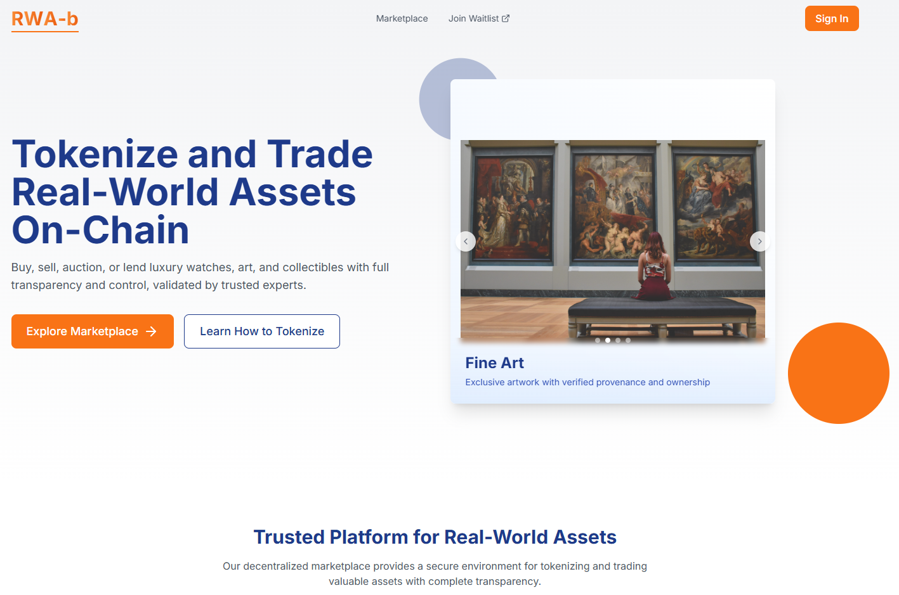

# RWA-b: RWA Tokenization Platform – Initial Proof of Concept (PoC)

## Overview

This repository contains the initial version of Proof of Concept (PoC) for the RWA Tokenization Platform. The purpose of this project is to validate the core architecture, business workflows, and technical feasibility of tokenizing real-world assets through a secure and scalable web platform.

The PoC focuses on demonstrating the complete asset lifecycle, from onboarding and token issuance to investor management and basic marketplace functionality.

---

# Project Objectives

The initial version aims to validate:

* User registration and authentication
* Asset onboarding and management
* Tokenization workflow
* Investor onboarding (KYC/AML simulation)
* Wallet integration
* Asset portfolio dashboard
* Basic marketplace
* Admin management portal
* Blockchain connectivity
* Backend API architecture

---

# Features

## Authentication

* User registration
* Login and logout
* JWT authentication
* Role-based access control

---

## Asset Management

* Create asset listings
* Upload asset information
* Asset approval workflow
* Asset status tracking

---

## Tokenization

* Token issuance process
* Asset-to-token mapping
* Smart contract integration
* Transaction history

---

## Investor Portal

* Investor profile
* Portfolio dashboard
* Asset browsing
* Investment history

---

## Marketplace

* Browse tokenized assets
* View asset details
* Transfer simulation
* Transaction records

---

## Admin Dashboard

* User management
* Asset approval
* Compliance monitoring
* Dashboard analytics

---

# Technology Stack

## Frontend

* React
* Next.js
* TypeScript
* Tailwind CSS

## Backend

* Node.js
* NestJS
* REST API

## Database

* PostgreSQL
* Redis

## Blockchain

* Solidity
* Ethereum-compatible Network (Polygon / Arbitrum under evaluation)
* OpenZeppelin
* Ethers.js

## Infrastructure

* Docker
* AWS
* GitHub Actions
* CI/CD

---

# Initial User Flow

1. User registers an account.
2. User completes KYC verification (simulated).
3. Asset issuer submits a real-world asset.
4. Administrator reviews and approves the asset.
5. Smart contract mints asset tokens.
6. Investors browse available assets.
7. Investors purchase or receive tokenized assets.
8. Portfolio updates automatically.
9. Marketplace displays available tokenized assets.

---

# Future Roadmap

* Secondary marketplace
* Yield distribution
* Oracle integration
* Fiat payment support
* Stablecoin settlement
* Multi-chain deployment
* Asset valuation engine
* Institutional onboarding
* Compliance automation
* Reporting and analytics

---

# Development Setup

### Prerequisites

* Node.js 18+
* PostgreSQL
* Redis
* Docker
* Git

### Installation

```bash
git clone <repository>

cd rwa-tokenization-platform

npm install

npm run dev
```
---

# MVP Scope

The current PoC is intended to validate the platform architecture and core business workflows. Some features use mocked data or simplified implementations while the team gathers user feedback and validates technical assumptions.

---

# Goals

* Validate product-market fit
* Demonstrate end-to-end tokenization workflow
* Test blockchain integration
* Validate investor experience
* Establish a scalable technical foundation for future releases

---

# Disclaimer

This project is an early-stage Proof of Concept and is intended for demonstration and validation purposes only. Features, architecture, and implementation details may change as the product evolves toward production.

# Project Setup Guide

## 1. Download a Project from a Public GitHub Repository

### Method 1: Using Git Commands

#### Step 1: Open a terminal

* **Windows:** Open **Command Prompt (CMD)**, PowerShell, or Windows Terminal.
* **macOS:** Open **Terminal**.
* **Linux:** Open your Terminal.

#### Step 2: Navigate to the folder where you want to download the project

For example:

```bash
cd Desktop
```

#### Step 3: Clone the GitHub repository

```bash
git clone https://github.com/hannahschreck87/rwa-initial-poc.git
```

Git will create a new folder containing the project.

#### Step 4: Go into the project folder

```bash
cd rwa-initial-poc
```

---

### Method 2: Using the GitHub Download Button

You can also download the project without using Git.

#### Step 1: Open the GitHub repository

Open the project's public GitHub repository in your web browser.

#### Step 2: Click the **Code** button

On the repository page, click:

**Code → Download ZIP**



#### Step 3: Extract the ZIP file

After the ZIP file finishes downloading:

* **Windows:** Right-click the ZIP file → **Extract All**
* **macOS:** Double-click the ZIP file.
* **Linux:** Right-click the ZIP file → **Extract Here** (the exact option may vary by desktop environment).

You should now have a project folder on your computer.

---

# 2. Install Node.js

## Windows

Open **Command Prompt** or **PowerShell** and run:

```powershell
winget install OpenJS.NodeJS.LTS
```

---

## Linux

The recommended approach is to use **nvm (Node Version Manager)**.

### Step 1: Install nvm

Open your Terminal and run:

```bash
curl -o- https://raw.githubusercontent.com/nvm-sh/nvm/v0.40.3/install.sh | bash
```

Close and reopen your terminal.

Alternatively, reload your shell configuration.

For Bash:

```bash
source ~/.bashrc
```

For Zsh:

```bash
source ~/.zshrc
```

### Step 2: Verify nvm

```bash
nvm --version
```

### Step 3: Install Node.js LTS

```bash
nvm install --lts
```

### Step 4: Use the LTS version

```bash
nvm use --lts
```

### Step 5: Verify Node.js and npm

```bash
node --version
```

```bash
npm --version
```

---

## macOS

The recommended approach is also **nvm (Node Version Manager)**.

### Step 1: Install nvm

Open **Terminal** and run:

```bash
curl -o- https://raw.githubusercontent.com/nvm-sh/nvm/v0.40.3/install.sh | bash
```

Close and reopen Terminal.

If necessary, reload your shell configuration.

For Zsh:

```bash
source ~/.zshrc
```

For Bash:

```bash
source ~/.bash_profile
```

### Step 2: Verify nvm

```bash
nvm --version
```

### Step 3: Install Node.js LTS

```bash
nvm install --lts
```

### Step 4: Use the LTS version

```bash
nvm use --lts
```

### Step 5: Verify the installation

```bash
node --version
```

```bash
npm --version
```

---

# 3. Go to the Downloaded Project

After downloading the project, you need to open a command-line window inside the project's folder.

## Windows

### Option 1: Using CMD

Open Command Prompt and use `cd` to navigate to the project.

For example:

```cmd
cd Desktop
cd rwa-initial-poc
```

Or:

```cmd
cd Desktop\rwa-initial-poc
```

### Option 2: Open CMD directly from File Explorer

1. Open the project folder in **File Explorer**.
2. Click the address bar.
3. Type:

```text
cmd
```

4. Press **Enter**.

A Command Prompt window will open directly in that folder.


---

## macOS

Open Terminal and navigate to the project.

For example:

```bash
cd ~/Desktop/rwa-initial-poc
```

---

## Linux

Open Terminal and navigate to the project.

For example:

```bash
cd ~/Desktop/rwa-initial-poc
```

---

# 4. Install the Project Dependencies

```bash
npm install
```

---

# 5. Run the Project

```bash
npm run dev
```

You may see output similar to:

```text
Local: http://localhost:5173/
```

Open the displayed address in your web browser.



---

